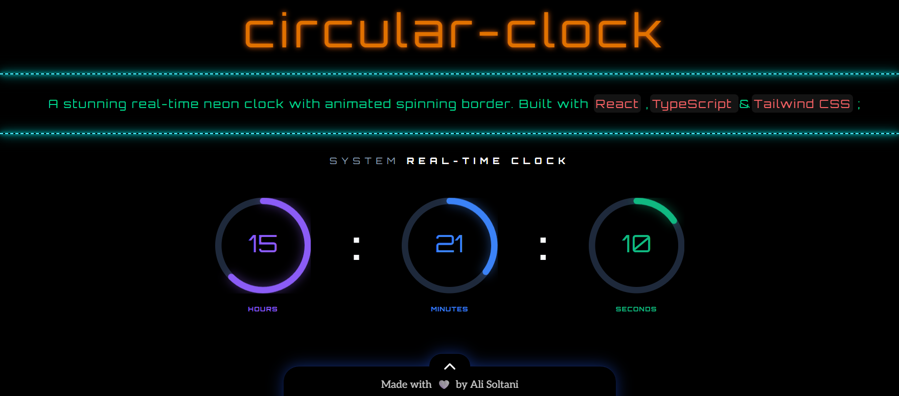

<!-- Neon Clock Project -->
# ⏱️ Neon Circular Clock

A neon-style animated clock built with `React`, `Vite`, `TypeScript`, and `Tailwind CSS`.  
Time is shown using **rotating circular borders** for seconds, minutes, and hours, with numbers displayed at the center.  
An interactive info card slides in and out from the bottom.
[](public/preview1.png)  

## ✨ Features

- ⏰ Circular animated clock (seconds, minutes, hours)
- 🔢 Centered numeric time display
- 🌈 Neon UI design
- 🧩 Toggleable bottom info card
- 📱 Responsive layout
- ⚡ Fast setup with Vite

---
## 💻 Installation:
>#### Clone the project with:
```
git clone https://github.com/alisoltaninejad/circular-clock
```
> run this commands:
```
npm i
npm run dev
```
